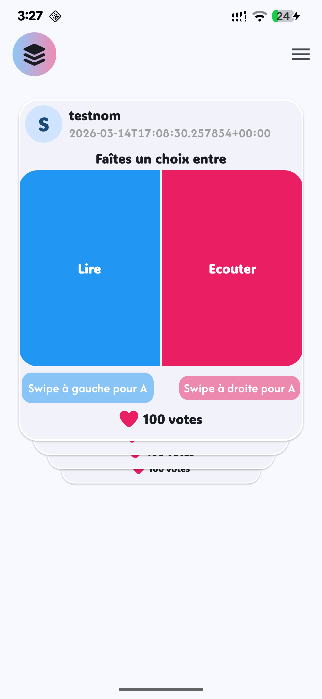
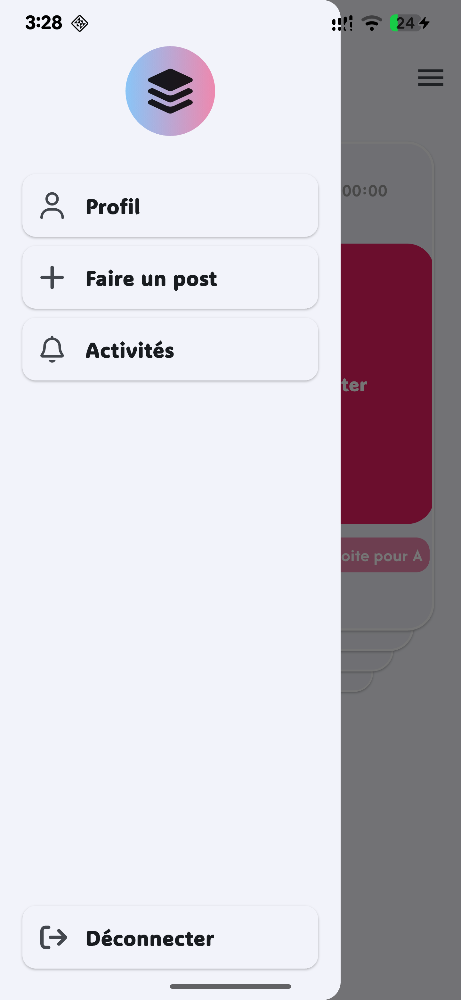
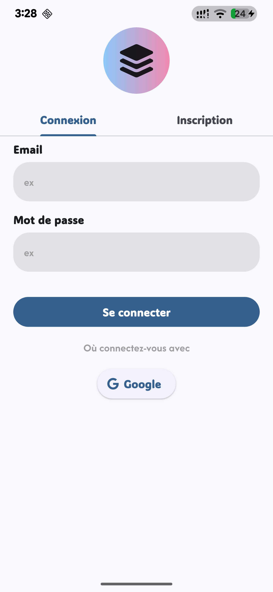
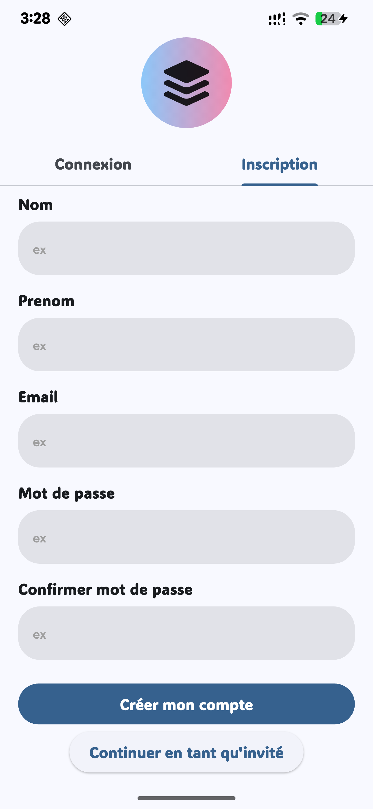

# Avis

Avis est une application mobile interactive conçue pour faciliter la prise de décision sociale à travers un système de "Swipe". Les utilisateurs peuvent poser des questions sous forme de duels (Texte vs Texte ou Image vs Image) et laisser la communauté voter via une interface intuitive inspirée de Tinder.

## Fonctionnalités

- **Authentification :** Creation de compte utilisateur et connexion au compte utilisateur
- **Système de Swipe :** Interaction sur les posts pour enregistrer les votes..
- **Création de Posts :** Support des duels textuels et visuels avec upload d'images.
- **Real-time Updates :** Flux de données en direct.
- **Sécurité Avancée :** Protection des données via des politiques RLS (Row Level Security) strictes.

## Aperću

 |  |  | 

## Stack technique
- **Front-end :** Flutter
- **Back-end :** Supabase(Auth, Storage)
- **State management :** Provider

## Architecture de la base de donnée 
Le projet utilise une base de données relationnelle robuste avec des Vues SQL pour optimiser les performances de lecture et simplifier le mapping des données dans Flutter.
- **Schema des tables :**
**Profiles** Stockage des informations des utilisateurs.
**posts** Contenu des duels (questions, options, auteur).
**interactions** Enregistrement des votes.

## Prochaines étapes
- Affichage des posts utilisateurs sur la page de profil
- Affichage des statistiques d'une post